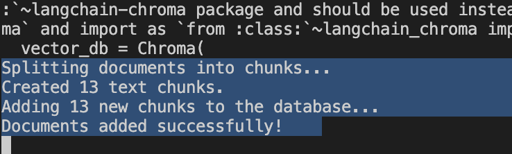
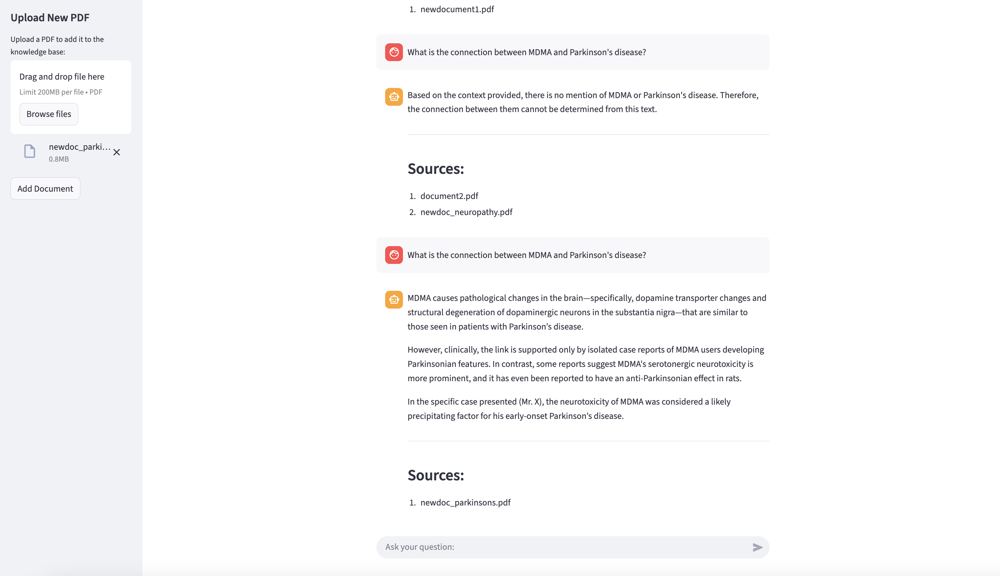

# 🩺 Advanced Medical AI - "Chat with your PDFs"

This is an end-to-end **Retrieval-Augmented Generation (RAG)** application that builds a private "knowledge base" from a collection of PDF documents and allows you to "chat" with them. This demo uses medical case reports, but it can work with any set of text-based PDFs!

## Demo: How it Works

This demo shows all three advanced features in action.

**(1) RAG + Source Citations:** We can ask a complex question that requires information from all the *initial* documents. The app synthesizes a single answer and correctly cites all its sources.

**(2) Chat History:** The app remembers the context of the conversation. We can ask a follow-up question ("which of those was in the 9-year-old child") that refers to our *very first question* ("complications"). The app understands "those" and provides the correct answer.


**(3) Live File Upload (Before & After):** We can teach the AI new information live.

- **Before:** We ask about a topic *not* in the database ("MDMA and Parkinson's"). The app correctly states it doesn't have the information.
- We upload a new file (`newdoc_parkinsons.pdf`) using the sidebar. The terminal will show that this new pdf is being ingested too

<table>
  <tr>
    <td>
      
    </td>
    <td>
      
    </td>
  </tr>
</table>

- **After:** We ask the *exact same question*, and the app now provides a perfect answer, citing the new file as its source.


## Tech Stack

- **Python 3.9+**
- **Streamlit**
- **LangChain**
- **Gemini API (`gemini-2.5-flash-preview-09-2025`)**
- **ChromaDB** 
- **HuggingFace Embedding (`all-MiniLM-L6-v2`)** 

## How to Run This Project

**Step 1: Setup Environment**
Clone this repository and navigate into it. Then, create and activate a virtual environment:

```
git clone https://github.com/sandyawijayaa/rag_medical_docs.git
cd rag_medical_project

python3 -m venv venv
source venv/bin/activate

```

**Step 2: Install All Dependencies**
Install all required packages in one command using the `requirements.txt` file:

```
pip install -r requirements.txt

```

**Step 3: Add API Key**
Create a file named `.env` in the project root. Add your Google API key to it. You can get this by opening https://aistudio.google.com/ and click "Get API key" to create one.

```
GOOGLE_API_KEY=YOUR_API_KEY_HERE

```

**Step 4: (Optional) Create Initial Database**
You can pre-load the app with a set of documents.

1. Place your PDFs into the `./documents` folder.
2. Run the `ingest_advanced.py` script *once*:
    
    ```
    python ingest_advanced.py
    
    ```
    

*(You can also skip this and build your database 100% live via the app's uploader.)*

**Step 5: Run the Advanced App**
Launch the Streamlit application:

```
streamlit run app_advanced.py

```

Your browser will open to `http://localhost:8501`. You can now chat with your documents and upload new ones via the sidebar.
